# DOCS.md — Consolidated Governance Documentation

> **How to use this document:**
> - **Normative truth** lives in code, schemas, tests, and designated source documents
> - **DOCS.md** is the consolidated reader-oriented guide
> - **Long-form reference docs** remain linked where detail matters

---

## Table of Contents

1. [Quick Start](#1-quick-start)
2. [Installation & Layout](#2-installation--layout)
3. [Bootstrap](#3-bootstrap)
4. [Architecture](#4-architecture)
5. [Phases & Flow](#5-phases--flow)
6. [Phase Transitions](#6-phase-transitions)
7. [State Machine Diagram](#7-state-machine-diagram)
8. [Session State](#8-session-state)
9. [Invariants](#9-invariants)
10. [Operating Rules](#10-operating-rules)
11. [Security Model](#11-security-model)
12. [Security Gates](#12-security-gates)
13. [Troubleshooting](#13-troubleshooting)
14. [Key Tests](#14-key-tests)
15. [Output Codes](#15-output-codes)
16. [Further Reading](#16-further-reading)
17. [Governance Configuration](#17-governance-configuration)

---

## 1. Quick Start

Short reference for getting started.

**SSOT:** `${SPEC_HOME}/phase_api.yaml` is the only truth for routing, execution, and validation.
**Kernel:** `governance_runtime/kernel/*` is the canonical control-plane implementation.
**MD files** are AI rails/guidance only and are never routing-binding.
**Phase 1.3** is mandatory before every phase >=2.

### Step 1: Install (2 min)

```bash
unzip customer-install-bundle-v1.zip && cd customer-install-bundle-v1
./install/install.sh
```

**Verify:** `./install/install.sh --status`

### Step 2: Verify installation

```bash
./install/install.sh --status
./install/install.sh --smoketest
```

### Step 3: Bootstrap session (1 min)

The installer places the `opencode-governance-bootstrap` launcher in a platform-specific config directory. Add that directory to your shell PATH, then invoke the launcher by name.

```bash
export PATH="$HOME/.config/opencode/bin:$PATH"
opencode-governance-bootstrap init --profile solo --repo-root /path/to/repo
```

**Profiles:** `solo`, `team`, `regulated`

### Step 4: Open Desktop and continue

After bootstrap succeeds, open OpenCode Desktop in the same repository and run `/continue`.

If `/continue` lands in Phase 4, run `/ticket` to persist the ticket/task, then run `/plan`.

**Review Commands:**
- `/review` — Read-only snapshot of current state, plan, and progress (use anytime)
- `/review-decision <approve|changes_requested|reject>` — Final decision at Phase 6 Evidence Presentation Gate

---

## 2. Installation & Layout

### Install

```bash
unzip customer-install-bundle-v1.zip
cd customer-install-bundle-v1
./install/install.sh
```

```powershell
Expand-Archive -Path customer-install-bundle-v1.zip -DestinationPath .
cd customer-install-bundle-v1
.\install\install.ps1
```

### Verify

```bash
./install/install.sh --status
./install/install.sh --smoketest
```

`governance.paths.json` under `<config_root>/` is required for canonical bootstrap behavior.

### Canonical Operator Path Truth

- **Install root (config):** `~/.config/opencode`
- **Install root (local payload):** `~/.local/opencode`
- **Canonical bin directory:** `~/.config/opencode/bin`
- **Canonical bootstrap entrypoint:** `opencode-governance-bootstrap init --profile <solo|team|regulated> --repo-root <repo-root>`
- Commands/plugins/workspaces live under config root; runtime/content/spec live under local root.
- `python -m ...` invocation is internal/debug/compatibility only and is not the primary operator path.

### Source-Repo Canonical Surfaces

```
governance_runtime/  # runtime authority (kernel, application, infrastructure)
governance_content/  # operator docs and command rails
governance_spec/     # policy/spec source of truth
```

### Post-Install Directory Layout (`<config_root>`)

```
<config_root>/
  bin/
    opencode-governance-bootstrap
    opencode-governance-bootstrap.cmd
  commands/
    audit-readout.md
    continue.md
    implement.md
    implementation-decision.md
    plan.md
    review-decision.md
    review.md
    ticket.md
  plugins/
    audit-new-session.mjs
  workspaces/
    <repo_fingerprint>/
      SESSION_STATE.json
      logs/
        error.log.jsonl
        flow.log.jsonl
        boot.log.jsonl
    _global/
      logs/
  opencode.json
  INSTALL_HEALTH.json
  INSTALL_MANIFEST.json
  governance.paths.json
  SESSION_STATE.json
  governance.activation_intent.json
```

```
<local_root>/
  governance_runtime/
  governance_content/
  governance_spec/
  VERSION
```

### Canonical Path Variables

- `${CONFIG_ROOT}`: OpenCode config root (runtime-resolved; do not hard-code OS paths)
- `${LOCAL_ROOT}`: OpenCode local payload root (runtime/content/spec payloads)
- `${COMMANDS_HOME}`: default `${CONFIG_ROOT}/commands` from installer binding evidence
- `${PROFILES_HOME}`: `${LOCAL_ROOT}/governance_content/profiles`
- `${WORKSPACES_HOME}`: default `${CONFIG_ROOT}/workspaces` from installer binding evidence

### Uninstall

```bash
python install.py --uninstall --force
```

Uninstall removes installer-owned governance files and runtime state, and preserves:
- opencode.json
- `governance.paths.json` (unless `--purge-paths-file` is passed)
- Non-governance user-owned files

---

## 3. Bootstrap

### Purpose

`opencode-governance-bootstrap` initializes or resumes a governance session for the current repository.
It creates the session state file, writes the initial audit event, and prepares the governance environment.
This launcher-first command is the only canonical operator bootstrap path.
`python -m ...` invocation is internal/debug/compatibility-only and not primary user guidance.

### Commands by Platform

#### With PATH configured

```bash
# macOS / Linux (bash / zsh)
export PATH="$HOME/.config/opencode/bin:$PATH"
opencode-governance-bootstrap init --profile solo --repo-root /path/to/repo
```

```powershell
# Windows (PowerShell)
$env:Path = "$env:USERPROFILE\.config\opencode\bin;" + $env:Path
opencode-governance-bootstrap init --profile solo --repo-root C:\path\to\repo
```

```cmd
:: Windows (cmd.exe)
set "PATH=%USERPROFILE%\.config\opencode\bin;%PATH%"
opencode-governance-bootstrap.cmd init --profile solo --repo-root C:\path\to\repo
```

#### Without PATH — invoke by full path

```bash
# macOS / Linux (bash / zsh)
~/.config/opencode/bin/opencode-governance-bootstrap init --profile solo --repo-root /path/to/repo
```

```powershell
& "$env:USERPROFILE\.config\opencode\bin\opencode-governance-bootstrap.cmd" init --profile solo --repo-root C:\path\to\repo
```

```cmd
"%USERPROFILE%\.config\opencode\bin\opencode-governance-bootstrap.cmd" init --profile solo --repo-root C:\path\to\repo
```

#### Optional flags

```bash
opencode-governance-bootstrap init --profile team --repo-root /path/to/repo --config-root /path/to/opencode-config
```

### Install/Layout Truth

- **Config root (default):** `~/.config/opencode`
  - `commands/`, `plugins/`, `workspaces/`, `bin/`
- **Local root (default):** `~/.local/opencode`
  - `governance_runtime/`, `governance_content/`, `governance_spec/`, `governance/`, `VERSION`
- **Workspace logs:** `~/.config/opencode/workspaces/<repo_fingerprint>/logs/`
- **Global logs:** `~/.config/opencode/workspaces/_global/logs/`

### Operating Mode Setup Surface

- Canonical setup path: `init --profile <solo|team|regulated>`
- Optional alias (administrative): `--set-operating-mode <solo|team|regulated>`

On success, bootstrap prints:
- `repoOperatingMode = <profile>`
- `resolvedOperatingMode default = <profile>`
- `policyPath = <repo>/.opencode/governance-repo-policy.json`

### Governance Mode Activation

When `--profile regulated` is specified during bootstrap:

1. `.opencode/governance-repo-policy.json` is created with `operatingMode: "regulated"`
2. `governance-mode.json` is created at repo root with `state: "active"`
3. The governance runtime enforces regulated constraints:
   - Retention lock (framework-specific minimum retention)
   - Four-eyes approval for archive operations
   - Immutable archives
   - Tamper-evident export

**Note:** The regulated profile maps to `agents_strict` runtime mode, not `pipeline`. Pipeline auto-approve does NOT apply to regulated/agents_strict mode.

### Troubleshooting Bootstrap

- **Repository root not found:** Verify you are inside the target repository, rerun from the repository root, or provide `--repo-root` explicitly.
- **Execution unavailable:** Verify the installer has been run and the launcher is on `PATH`.

---

## 4. Architecture

### Overview

The governance system uses a canonical state model to centralize legacy field name resolution and establish a single source of truth for session state field access.

### Problem

The codebase historically supported multiple field name conventions:
- PascalCase: `Phase`, `Next`, `Status`
- snake_case: `phase`, `next`, `status`
- Mixed: `Phase5State`, `phase5_completed`

This led to scattered alias resolution logic, inconsistent field access patterns, and maintenance burden.

### Solution: Canonical Model

```python
# governance_runtime/application/dto/canonical_state.py
CanonicalSessionState = TypedDict('CanonicalSessionState', {
    'phase': str,
    'next_action': str,
    'active_gate': str,
    'status': str,
    # ... all fields use snake_case
})
```

### Centralized Resolution

```python
# governance_runtime/application/services/state_normalizer.py
def normalize_to_canonical(state: dict) -> CanonicalSessionState:
    """Convert legacy state dict to canonical form."""
    # All alias resolution happens here
```

### Architecture Rules

1. **Single Resolution Point:** Alias resolution only in `state_normalizer.py`
2. **Kernel Uses Canonical:** Kernel code must use `CanonicalSessionState` via `normalize_to_canonical()`
3. **Read-Path Compatibility:** Legacy inputs may be normalized on read; productive writes must use canonical structures only
4. **Architecture Test:** `test_alias_resolution_only_in_allowed_modules` enforces the rule

### Usage

```python
from governance_runtime.application.services.state_normalizer import normalize_to_canonical

# Read state canonically
canonical = normalize_to_canonical(raw_state)
phase = canonical["phase"]  # guaranteed canonical name

# Use helpers for common access patterns
from governance_runtime.application.services.state_accessor import get_phase, get_active_gate
phase = get_phase(state)
```

---

## 5. Phases & Flow

### Customer View (Short)

- **Phase 0** triggers bootstrap and initializes the governance runtime workspace.
- **Phase 1.1 (Bootstrap)** validates install/path/session prerequisites before work proceeds. It sets the `Workspace Ready Gate`.
- **Phase 1 (Workspace Persistence)** persists bootstrap artifacts and verifies workspace state.
- **Phase 1.2 (Activation Intent)** captures activation intent with sha256 evidence.
- **Phase 1.3 (Rulebook Load)** loads core/profile/templates/addons rulebooks with evidence before routing to Phase 2.
- **Phase 2 (Repository Discovery)** builds repo context and reusable decision artifacts.
- **Phase 2.1 (Decision Pack)** creates the Decision Pack and resolves Phase 1.5 routing.
- **Phase 1.5 (Business Rules Discovery, optional)** extracts business rules; once executed, Phase 5.4 becomes mandatory.
- **Phase 3A (API Inventory)** inventories external API artifacts — always executed, may record `not-applicable`.
- **Phase 3B-1 / 3B-2 (API Validation)** run only when APIs are detected.
- **Phase 4 (Ticket Intake)** produces the concrete implementation plan; `/review` is a read-only rail entrypoint for feedback.
- **Phase 5 - Lead Architect Review** — `/plan` auto-generates a plan from the persisted ticket/task via Desktop LLM, runs self-review (min 1, max 3 iterations), compiles requirement contracts, and persists plan-record evidence.
- **Phase 5.3 / 5.4 / 5.5 / 5.6** are conditional gates following Phase 5.
- **Phase 6 (Implementation)** runs internal review loop, then presents evidence. Final decision via `/review-decision` (approve | changes_requested | reject).

### Canonical Flow

```
0 → 1.1 → 1 → 1.2 → 1.3 → 2 → 2.1
  After 2.1: if business_rules_execute → 1.5 → 3A; else → 3A
  Phase 3A: if no_apis → 4; else → 3B-1 → 3B-2 → 4
  Main execution: 4 → 5 → 5.3 → [5.4] → [5.5] → [5.6] → 6
  Phase 6 internal: Implementation Internal Review (max 3 iterations)
    → Evidence Presentation Gate
    → /review-decision <approve|changes_requested|reject>
      approve     → Workflow Complete (terminal)
      changes_requested → Rework Clarification Gate (Phase 6)
      reject      → Phase 4 (Ticket Input Gate)
```

### Phase Transitions (from phase_api.yaml)

Kernel routing follows one deterministic priority chain:
1. First matching `specific` transition
2. Otherwise `default`
3. Otherwise `next`
4. Otherwise terminal/config error

### Key Transition Table

| From | To | When | Source |
|------|----|------|--------|
| 0 | 1.1 | always | implicit |
| 1.1 | 1 | always | implicit |
| 1 | 1.2 | always | implicit |
| 1.2 | 1.3 | default | phase-1.2-to-1.3-auto |
| 1.3 | 2 | always | implicit |
| 2 | 2.1 | always | implicit |
| 2.1 | 1.5 | business_rules_execute | phase-1.5-routing-required |
| 2.1 | 3A | default | phase-2.1-to-3a |
| 1.5 | 3A | default | phase-1.5-to-3a |
| 3A | 4 | no_apis | phase-3a-not-applicable-to-phase4 |
| 3A | 3B-1 | default | phase-3a-to-3b1 |
| 3B-1 | 3B-2 | default | phase-3b1-to-3b2 |
| 3B-2 | 4 | default | phase-3b2-to-4 |
| 4 | 5 | ticket_present | phase-4-to-5-ticket-intake |
| 4 | 4 | default (stay) | phase-4-awaiting-ticket-intake |
| 5 | 5 | plan_record_missing | phase-5-plan-record-prep-required |
| 5 | 5 | self_review_iterations_pending | phase-5-self-review-required |
| 5 | 5.3 | self_review_iterations_met | phase-5-architecture-review-ready |
| 5.3 | 5.4 | business_rules_gate_required | phase-5.3-to-5.4 |
| 5.3 | 5.5 | technical_debt_proposed | phase-5.3-to-5.5 |
| 5.3 | 5.6 | rollback_required | phase-5.3-to-5.6 |
| 5.3 | 6 | default | phase-5.3-to-6 |
| 5.4 | 5.5 | technical_debt_proposed | phase-5.4-to-5.5 |
| 5.4 | 5.6 | rollback_required | phase-5.4-to-5.6 |
| 5.4 | 6 | default | phase-5.4-to-6 |
| 5.5 | 5.6 | rollback_required | phase-5.5-to-5.6 |
| 5.5 | 6 | default | phase-5.5-to-6 |
| 5.6 | 6 | default | phase-5.6-to-6 |
| 6 | 4 | review_rejected | phase-6-rejected-to-phase4 |
| 6 | 6 | implementation_review_complete | phase-6-ready-for-user-review |

### Gate Requirements for Code Generation

| Gate | Phase | Required? | Condition |
|------|-------|-----------|-----------|
| P5-Architecture | 5 | Unconditional | Requires `approved` status after self-review iterations met (min 1, max 3) |
| P5.3-TestQuality | 5.3 | Unconditional | Requires `pass` or `pass-with-exceptions` |
| P5.4-BusinessRules | 5.4 | Conditional | Only if Phase 1.5 was executed |
| P5.5-TechnicalDebt | 5.5 | Unconditional | Always checked; `approved` or `not-applicable` required |
| P5.6-RollbackSafety | 5.6 | Conditional | When rollback-sensitive changes exist |
| P6-ImplementationQA | 6 | Unconditional | Requires `ready-for-pr` |

### Kernel CLI Entrypoints

| Entrypoint | Module | Purpose |
|-----------|--------|---------|
| Bootstrap | `cli.bootstrap init` | Initializes workspace, runs persistence hook |
| `/continue` | `governance_runtime.entrypoints.session_reader --materialize` | Advances routing, runs Phase 6 internal loop |
| `/ticket` | `governance_runtime.entrypoints.phase4_intake_persist` | Persists ticket/task intake evidence |
| `/plan` | `governance_runtime.entrypoints.phase5_plan_record_persist` | Auto-generates plan from Ticket/Task via LLM, runs self-review, persists plan-record evidence |
| `/implement` | `governance_runtime.entrypoints.implement_start` | Starts implementation execution (Phase 6) |
| `/review-decision` | `governance_runtime.entrypoints.review_decision_persist --decision <approve\|changes_requested\|reject>` | Final review decision at Evidence Presentation Gate |
| `/review` | `governance_runtime.entrypoints.session_reader` (read-only) | Read-only rail for review-depth feedback — shows current state, plan, implementation status without advancing phase |

### `/review` — Read-only Review Rail

Use `/review` at any time to get a detailed review-depth snapshot of the current workflow state.

**What it shows:**
- Current phase and gate status
- Plan record (if Phase 5 complete)
- Implementation progress (if Phase 6 active)
- Review feedback history (if available)
- Next recommended action

**What it does NOT do:**
- Does NOT advance the phase
- Does NOT persist any changes
- Does NOT trigger LLM calls

**When to use:**
- Before `/plan` to understand current scope
- Before `/review-decision` to assess implementation quality
- After `/continue` to verify state transition

### Phase 6 Review Decision

At the Evidence Presentation Gate (`implementation_review_complete`), the workflow depends on the profile:

**Team Profile (pipeline mode):**
When internal review is complete and eligibility conditions are met, the workflow auto-approves automatically. No manual `/review-decision` required.

**Solo/Regulated Profiles:**
The operator must run `/review-decision`:

| Decision | Effect |
|----------|--------|
| `approve` | Workflow Complete — terminal state within Phase 6 (`workflow_complete=true`) |
| `changes_requested` | Enter Rework Clarification Gate in Phase 6 — clarify in chat first, then run exactly one directed rail (`/ticket`, `/plan`, or `/continue`) |
| `reject` | Back to Phase 4 — restart from planning (Ticket Input Gate) |

**Key:** `/continue` does NOT advance past the Evidence Presentation Gate in solo/regulated modes. The operator must explicitly run `/review-decision` (or workflow auto-completes in team/pipeline mode).

---

## 6. Phase Transitions

> [Translated from German source document: `governance_runtime/TRANSITION_INVENTUR.md`]

### Phase 4: Ticket Intake

| Start Gate | Event/Condition | Guard | Target Phase | Target Gate | next_action |
|------------|-----------------|-------|--------------|-------------|-------------|
| Ticket Input Gate | - | - | 4 | Ticket Input Gate | `/ticket` |
| Ticket Input Gate | - | - | 4 | - | `/review` (read-only) |
| Plan Record Preparation Gate | versions < 1 | - | 4 | Plan Record Preparation Gate | `/plan` |
| Ticket Input Gate | ticket provided | ready=true | 4 | Scope Change Gate | `/continue` |

### Phase 5: Architecture & Quality Gates

| Start Gate | Event/Condition | Guard | Target Phase | Target Gate | next_action |
|------------|-----------------|-------|--------------|-------------|-------------|
| Architecture Review Gate | P5-Architecture approved | - | 5.3 | Test Quality Gate | `/continue` |
| Test Quality Gate | P5.3 passed | - | 5.4 | Business Rules Gate | `/continue` |
| Business Rules Gate | p54 status | p54 not compliant | 5.4 | Business Rules Gate | `chat` (blocked) |
| Business Rules Gate | p54 compliant | - | 5.5 | Technical Debt Gate | `/continue` |
| Technical Debt Gate | p55 status | p55 not approved | 5.5 | Technical Debt Gate | `chat` (blocked) |
| Technical Debt Gate | p55 approved | - | 5.6 | Rollback Safety Gate | `/continue` |
| Rollback Safety Gate | p56 status | p56 not approved | 5.6 | Rollback Safety Gate | `chat` (blocked) |
| Rollback Safety Gate | p56 approved | - | 6 | - | `/continue` |

### Phase 6: Implementation & Review

| Start Gate | Event/Condition | Guard | Target Phase | Target Gate | next_action |
|------------|-----------------|-------|--------------|-------------|-------------|
| Implementation Presentation Gate | - | - | 6 | Implementation Presentation Gate | `/implementation-decision` |
| Implementation Decision | approve | - | 6 | Implementation Started | `/implement` |
| Implementation Decision | reject | - | 6 | Implementation Rework Gate | `chat` (blocked) |
| Implementation Started | - | - | 6 | Implementation Execution | `execute` |
| Implementation Execution | iteration complete | - | 6 | Implementation Self Review | `/continue` |
| Implementation Self Review | iteration < max | - | 6 | Implementation Revision | `/continue` |
| Implementation Revision | revisions done | - | 6 | Implementation Verification | `/continue` |
| Implementation Verification | verified | - | 6 | Implementation Review Complete | `/continue` |
| Implementation Review Complete | - | - | 6 | Evidence Presentation Gate | `/continue` |
| Evidence Presentation Gate | - | - | 6 | Evidence Presentation Gate | `/review-decision` |
| Review Decision | approve | - | 6 | Workflow Complete | `/implement` |
| Review Decision | changes_requested | - | 6 | Rework Clarification Gate | `chat` (blocked) |
| Review Decision | reject | - | 4 | Ticket Input Gate | `chat` (blocked) |
| Rework Clarification Gate | clarification provided | type=scope_change | 4 | Ticket Input Gate | `/ticket` |
| Rework Clarification Gate | clarification provided | type=plan_change | 4 | Plan Record Preparation Gate | `/plan` |
| Rework Clarification Gate | clarification provided | type=other | 6 | Evidence Presentation Gate | `/continue` |
| Workflow Complete | - | - | 6 | Workflow Complete | `/implement` |
| Implementation Blocked | blockers resolved | - | 6 | - | `/implement` |
| Implementation Accepted | - | - | - | - | `delivery` (terminal) |

### Rework Classification Routing

| Classification | Target Gate | next_action |
|----------------|-------------|-------------|
| `scope_change` | Ticket Input Gate | `/ticket` |
| `plan_change` | Plan Record Preparation Gate | `/plan` |
| `clarification_only` | Evidence Presentation Gate | `/continue` |
| `unknown` | Evidence Presentation Gate | `/continue` |

### Key Gates (Canonical)

```
Ticket Input Gate
Plan Record Preparation Gate
Scope Change Gate
Architecture Review Gate
Test Quality Gate
Business Rules Gate
Technical Debt Gate
Rollback Safety Gate
Implementation Presentation Gate
Implementation Rework Gate
Implementation Started
Implementation Execution
Implementation Self Review
Implementation Revision
Implementation Verification
Implementation Review Complete
Evidence Presentation Gate
Rework Clarification Gate
Workflow Complete
Implementation Blocked
Implementation Accepted
```

### Commands (Outputs)

| Command | Kind | Description |
|---------|------|-------------|
| `/ticket` | normal | Ticket/Task intake |
| `/plan` | normal | Plan creation |
| `/continue` | normal | Phase progress |
| `/review-decision` | normal | Review decision |
| `/implementation-decision` | normal | Implementation decision |
| `/implement` | terminal/blocked | Start implementation |
| `chat` | blocked | Chat interaction required |
| `execute` | implementation | Execute implementation |
| `delivery` | terminal | Delivery complete |

---

## 7. State Machine Diagram

> **Note:** This Mermaid diagram is a simplified schematic overview of the governance phases and key decision points. For the complete transition model with all gates and routing rules, see the generated PlantUML file (`governance_runtime/docs/state_machines/governance.puml`) and the Phase Transitions section above.

```mermaid
stateDiagram-v2
    direction LR

    [*] --> Phase4 : Ticket/Plan Input

    state "Phase 4" as Phase4 {
        ticket_input_gate : Ticket Input Gate
        plan_record_prep_gate : Plan Record Prep Gate
    }

    state "Phase 5" as Phase5 {
        arch_review : Architecture Review Gate
        test_quality : Test Quality Gate
        business_rules : Business Rules Gate
        tech_debt : Technical Debt Gate
        rollback_safety : Rollback Safety Gate
    }

    state "Phase 6" as Phase6 {
        evidence_gate : Evidence Presentation Gate
        workflow_complete : Workflow Complete
    }

    Phase4 --> Phase5 : /continue (ticket present)
    Phase5 --> Phase6 : /continue (gates passed)

    Phase6 --> Phase6 : /review-decision (awaiting decision)
    Phase6 --> [*] : approve
    Phase6 --> Phase4 : reject
```



---

## 8. Session State

This section provides a compact overview of the **external session contract surface**. For the full specification, see [SESSION_STATE_SCHEMA.md](SESSION_STATE_SCHEMA.md).

> **Note:** The external `SESSION_STATE` surface (PascalCase keys like `Phase`, `Next`, `Mode`) is distinct from the internal canonical runtime model (snake_case `CanonicalSessionState`). See the [Architecture](#4-architecture) section for details on the canonical state model.

### External Contract Surface (Assistant Output)

The assistant outputs `SESSION_STATE` in responses that advance or evaluate the workflow:

- Two output modes: **MIN** (default, small stable fields only) and **FULL** (expanded, for gates/blocked state).
- `SESSION_STATE.Next` is a string describing the next executable step.
- Every response containing `SESSION_STATE` MUST end with `NEXT_STEP: <value>`.

### Required Keys (Phase 1+)

After Phase 1.1 (bootstrap) completes successfully:

- `session_state_version` (integer)
- `ruleset_hash` (string OR `null`)
- `Phase` (enum)
- `Mode` (enum: `NORMAL`, `DEGRADED`, `DRAFT`, `BLOCKED`)
- `OutputMode` (enum: `ARCHITECT`, `IMPLEMENT`, `VERIFY`)
- `ConfidenceLevel` (integer 0–100)
- `Next` (string; canonical continuation pointer)
- `Bootstrap.Present`, `Bootstrap.Satisfied`, `Bootstrap.Evidence`
- `Scope`, `RepoFacts`, `LoadedRulebooks.*`, `ActiveProfile`, `Gates`, `ticket_intake_ready`

### Gates

`SESSION_STATE.Gates` MUST exist after Phase 1:

| Gate | Values |
|------|--------|
| P5-Architecture | `pending \| approved \| rejected` |
| P5.3-TestQuality | `pending \| pass \| pass-with-exceptions \| fail` |
| P5.4-BusinessRules | `pending \| compliant \| gap-detected \| not-applicable` |
| P5.5-TechnicalDebt | `pending \| approved \| rejected \| not-applicable` |
| P5.6-RollbackSafety | `pending \| approved \| rejected \| not-applicable` |
| P6-ImplementationQA | `pending \| ready-for-pr \| fix-required` |

### Invariants

- If `ConfidenceLevel < 70`, auto-advance and code-producing output are forbidden.
- When in a blocked state, `Next` starts with `BLOCKED-`.
- `Next` MUST NOT skip mandatory gates.
- Canonical path fields must not contain forbidden patterns (drive prefixes, backslashes, parent traversal).

### Canonical BLOCKED Next Pointers

- `BLOCKED-BOOTSTRAP-NOT-SATISFIED`
- `BLOCKED-START-REQUIRED`
- `BLOCKED-MISSING-CORE-RULES`
- `BLOCKED-MISSING-PROFILE`
- `BLOCKED-AMBIGUOUS-PROFILE`
- `BLOCKED-MISSING-ADDON:<addon_key>`
- `BLOCKED-STATE-OUTDATED`
- `BLOCKED-MISSING-EVIDENCE`
- `BLOCKED-WORKSPACE-PERSISTENCE`

---

## 9. Invariants

Governance invariants that must remain true. Any change violating one item is a regression.

### Control Plane / Bootstrap

- [ ] Bootstrap must call only read-only governance helpers.
- [ ] `governance_runtime/bootstrap_preflight_persistence.py` must not exist.
- [ ] Diagnostics must not write workspace/index/session artifacts.

### Repo Identity / Resolution

- [ ] Repo root resolution is git-evidence-only (`git rev-parse --show-toplevel`).
- [ ] No CWD fallback, no parent-walk, no `.git` presence heuristic for identity.
- [ ] Unresolved / fingerprint-missing state must not expose `repo_root`.

### Workspace Ready Gate

- [ ] Workspace readiness is committed by kernel gate only.
- [ ] Gate uses lock dir (`workspaces/<fp>/locks/workspace.lock/`).
- [ ] Gate writes `marker.json` and `evidence/repo-context.resolved.json`.
- [ ] Session pointer is updated atomically.

### Phase Routing / Ticket Guard

- [ ] Phase routing is evidence/persisted-state driven and monotonic.
- [ ] Phase 2/3 progression requires committed workspace-ready gate.
- [ ] Ticket/task prompts are not allowed before phase 4.
- [ ] Phase 4 remains planning-only (code-output requests blocked).

### Persistence Policy (Phase-Coupled)

- [ ] Persistence decisions are centralized in policy (`allowed` vs `blocked`).
- [ ] Workspace-memory decisions require phase 5 approval + confirmation evidence.
- [ ] Pipeline mode cannot satisfy confirmation flow; must fail closed.
- [ ] Repository writer guards enforce policy even on direct calls.

### SESSION_STATE Invariants

- [ ] When blocked, `Next` starts with `BLOCKED-`.
- [ ] `ConfidenceLevel < 70` requires `Mode` to be `DRAFT` or `BLOCKED`.
- [ ] If `ProfileSource=ambiguous`, the session is in a blocked state.
- [ ] Reason codes require `Diagnostics.ReasonPayloads` to be present.
- [ ] `OutputMode=ARCHITECT` requires `DecisionSurface` to exist.
- [ ] Canonical path fields must not contain forbidden patterns.
- [ ] Phase 5/6 code-producing steps require upstream gates to be in allowed state.

### Executable Invariants (State Invariants)

These invariants are enforced by code in `governance_runtime/application/services/state_invariants.py` and tested in `tests/test_state_invariants.py`:

| ID | Constraint |
|----|------------|
| INV-001 | If `phase6_state == 'phase6_completed'`, then `ReviewPackage.presented == True` |
| INV-002 | If `phase5_completed == True`, then phase must start with '5' or '6' |
| INV-010 | If `phase6_state == 'phase6_in_progress'`, then `implementation_review_complete` must be False |
| INV-100 | If `active_gate == 'Evidence Presentation Gate'`, then phase must start with '6' |
| INV-110 | If `active_gate == 'Rework Clarification Gate'`, then phase must start with '6' |
| INV-200 | If `ReviewPackage.presented == True`, then `ReviewPackage` must have `review_object` |
| INV-300 | If `ImplementationReview` block exists, then phase must start with '6' |

### Release Gate

Before merge, run:

```bash
python3 -m pytest -q
```

Expected: full suite green (except explicitly skipped tests).

---

## 10. Operating Rules

> [Translated from German source document: `governance_runtime/OPERATING_RULES.md`]

### Architecture Contract

#### State Management

| Rule | Description |
|------|-------------|
| **Alias Source** | `state_normalizer.py` is the ONLY alias source |
| **Access Layer** | Entrypoints use `state_accessor.py` |
| **Plan Reading** | `plan_reader.py` for plan content |
| **Validation** | Fail-closed at critical boundaries |

#### Architecture Boundaries

| Rule | Description |
|------|-------------|
| **No new alias locations** | Alias resolution ONLY in `state_normalizer.py` |
| **No App→Infra imports** | Application layer must not import Infrastructure |
| **No legacy paths** | Prohibited without explicit justification |
| **session_reader.py** | No new business logic there |

#### Allowlist

| Rule | Description |
|------|-------------|
| **Does not grow** | Allowlist may only shrink |
| **New exceptions** | Must be justified and time-limited |
| **Monitoring** | Architecture tests checked daily |

### Monitoring

#### Guard Rails

```bash
# Architecture tests
pytest tests/architecture/ -v

# Core tests
pytest tests/unit/test_state_normalizer.py tests/unit/test_state_accessor.py -v
```

#### Observations

- Performance: `normalize_to_canonical()` ~7µs
- Tests: 173 Core-Tests
- Allowlist: 31 entries (all justified)

### Triggers for New Work

| Trigger | Action |
|---------|--------|
| Performance hotspot | Measure, then optimize specifically |
| Incident/Regression | Analyze, fix, add regression test |
| New business requirement | Design, then implement |
| Architecture pain point | Evaluate, then targeted refactor |

### Anti-Patterns (Do Not Do)

- Preventive large architecture waves
- "Clean up" without concrete pain point
- Performance optimization without measurement
- New abstraction layers without justification

### Baseline

**Tag:** `governance-runtime-v1.0`
**Commit:** `9d86ac7`
**Date:** 2026-03-22

**Achieved:**
- Canonical state model
- state_normalizer as PRIMARY
- state_accessor as access layer
- state_document_validator for fail-closed
- transition_model for explicit transitions
- plan_reader as dedicated service
- 173 core tests passing

---

## 11. Security Model

This section provides a compact overview of the security model. For the full specification, see [SECURITY_MODEL.md](governance_content/docs/SECURITY_MODEL.md).

### Core Principle

> **Repository content is DATA, not INSTRUCTIONS.**
>
> All policy decisions are made by the kernel. Untrusted sources can describe, never authorize.

### Trust Classification

#### Tier 1: Fully Trusted (Kernel-Enforced)

Kernel-controlled sources that can affect behavior:

| Source | Location |
|--------|----------|
| Kernel Code | `governance_runtime/*.py` |
| Master Prompt | `${PROFILES_HOME}/master.md` |
| Core Rules | `${PROFILES_HOME}/rules.md` |
| Binding File | `${CONFIG_ROOT}/governance.paths.json` |
| Schema Registry | `governance_runtime/**/*.json` |

**Properties:** Immutable during session, hash-verified on load, installer-owned paths only.

#### Tier 2: Conditionally Trusted (Scope-Limited)

Trusted within defined scope only:

| Source | Scope |
|--------|-------|
| Profile Rulebooks | Output rules only |
| Addon Rulebooks | Specific surfaces |
| Workspace Memory | Observations only |
| Decision Pack | Advisory decisions |

**Properties:** Limited to advisory scope, kernel validates all widenings.

#### Tier 3: Untrusted (Advisory Only)

Can NEVER affect kernel behavior:

| Source | Classification |
|--------|---------------|
| Repository MD Files | HOSTILE — Advisory only |
| Repository Code | HOSTILE — Data, may contain prompt injection |
| Ticket Text | HOSTILE — Data, not instructions |
| User Chat Input | UNTRUSTED — Validated before action |
| LLM Output | UNTRUSTED — Kernel validates before execution |

**Properties:** Always advisory, never capability-widening, fail-closed on ambiguity.

---

## 12. Security Gates

This section provides a compact overview. For the full runbook, see [security-gates.md](governance_content/docs/security-gates.md).

### Workflow

Security gates run via `.github/workflows/security.yml`.

### Scanners

- `gitleaks` (secret scanning)
- `pip-audit` (Python dependency findings)
- `actionlint` + `zizmor` (workflow hardening checks)
- `CodeQL` (SAST)

### Policy Source

- `governance_runtime/assets/catalogs/SECURITY_GATE_POLICY.json`

Key policy controls:
- `block_on_severities`: findings at these severities block the gate
- `fail_closed_on_scanner_error`: scanner failures block the gate
- `session_state_evidence_key`: canonical evidence mapping key

### Blocking Semantics

The gate blocks when either condition holds:
1. Any finding severity in `block_on_severities` has count > 0
2. Scanner status is not `success` and `fail_closed_on_scanner_error=true`

### Evidence Outputs

Each scanner writes a summary JSON file in `${WORKSPACES_HOME}/_global/security-evidence/`.

---

## 13. Troubleshooting

This section provides common issues. For the full troubleshooting reference, see [operator-runbook.md](governance_content/docs/operator-runbook.md).

### Health Checks

```bash
# Full health check (one-liner)
python scripts/validate_rulebook.py --all \
  && python scripts/governance_lint.py \
  && python scripts/migrate_rulebook_schema.py --check
```

### Common BLOCKED Codes

| Code | Description | Fix |
|------|-------------|-----|
| `BLOCKED-BOOTSTRAP-NOT-SATISFIED` | Bootstrap gates not satisfied | Run bootstrap launcher |
| `BLOCKED-MISSING-BINDING-FILE` | Installer binding file missing | Rerun installer |
| `BLOCKED-REPO-ROOT-NOT-DETECTABLE` | Repository not found | Provide `--repo-root` |
| `BLOCKED-WORKSPACE-PERSISTENCE` | Workspace persistence failed | Check logs, verify permissions |
| `BLOCKED-MISSING-CORE-RULES` | Core rules file not loaded | Restore `rules.md` |
| `BLOCKED-MISSING-PROFILE` | Active profile missing | Select valid profile |
| `BLOCKED-STATE-OUTDATED` | Persisted state is stale | Re-run bootstrap |
| `BLOCKED-MISSING-EVIDENCE` | Required evidence missing | Check `ReasonPayloads` |

### Upgrade Procedure

1. Run full health check and confirm all pass
2. Note current version: `cat VERSION`
3. Back up profile rulebooks: `cp -r rulesets/ rulesets.bak/`
4. Dry run: `python scripts/migrate_rulebook_schema.py --dry-run`
5. Execute: `python scripts/migrate_rulebook_schema.py --target-version <VERSION>`
6. Post-upgrade verification: run health check again

### Rollback

If any issues after upgrade:
```bash
cp -r rulesets.bak/ rulesets/
python scripts/migrate_rulebook_schema.py --check
```

---

## 14. Key Tests

| Test | Description |
|------|-------------|
| `tests/test_governance_flow_truth.py` | E2E workflow (Ticket → Plan → Review → Implement) |
| `tests/test_phase_transition_audit.py` | Phase transitions and audit logic |
| `tests/test_review_decision_persist_entrypoint.py` | Review decision validation |
| `tests/test_state_invariants.py` | State invariants (Phase 6, Gates) |
| `tests/test_session_reader.py` | Session snapshot and materialization |

### Run Tests

```bash
# Run all tests
python3 -m pytest tests/ -q

# Run specific test
python3 -m pytest tests/test_governance_flow_truth.py -v
```

---

## 15. Output Codes

| Code | Meaning | Fix |
|------|---------|-----|
| `BLOCKED-MISSING-BINDING-FILE` | Install not run | Rerun the installer from the bundle |
| `BLOCKED-REPO-ROOT-NOT-DETECTABLE` | Repository not found | Provide `--repo-root` |
| `BLOCKED-WORKSPACE-PERSISTENCE` | Bootstrap failed | Check logs |

---

## 16. Further Reading

### Primary Source Documents

These documents remain the authoritative sources for their respective domains:

| Document | Purpose |
|----------|---------|
| [SESSION_STATE_SCHEMA.md](SESSION_STATE_SCHEMA.md) | Full session state contract |
| [SECURITY_MODEL.md](governance_content/docs/SECURITY_MODEL.md) | Complete trust model |
| [operator-runbook.md](governance_content/docs/operator-runbook.md) | Full troubleshooting reference |
| [governance_invariants.md](governance_content/docs/governance_invariants.md) | Complete invariants checklist |
| [phases.md](governance_content/docs/phases.md) | Detailed phase map |
| [ARCHITECTURE_CANONICAL_STATE.md](governance_runtime/ARCHITECTURE_CANONICAL_STATE.md) | Architecture documentation |
| [OPERATING_RULES.md](governance_runtime/OPERATING_RULES.md) | Operating rules (German) |
| [TRANSITION_INVENTUR.md](governance_runtime/TRANSITION_INVENTUR.md) | Phase transition inventory (German) |
| [BOOTSTRAP.md](BOOTSTRAP.md) | Bootstrap details |
| [QUICKSTART.md](QUICKSTART.md) | Quick start reference |
| [install-layout.md](governance_content/docs/install-layout.md) | Install layout details |

### Generated Artifacts

| Artifact | Purpose |
|----------|---------|
| [governance.puml](governance_runtime/docs/state_machines/governance.puml) | PlantUML state machine (source) |
| [phase_api.yaml](governance_spec/phase_api.yaml) | Routing/execution/validation SSOT |

### Other

| Document | Purpose |
|----------|---------|
| [CHANGELOG.md](CHANGELOG.md) | Version history |
| [ADR.md](ADR.md) | Architecture decision records |

---

## 17. Governance Configuration

`governance-config.json` allows customization of governance behavior at the workspace level.

### Location

```
~/.config/opencode/workspaces/<repo-fingerprint>/governance-config.json
```

### Bootstrap Materialization

During workspace bootstrap, the default `governance-config.json` is automatically materialized to the workspace if not already present. This ensures every workspace has sensible defaults out-of-the-box.

**Idempotent:** Existing configurations are never overwritten.

**Graceful degradation:** If the default asset cannot be read, bootstrap continues and falls back to hardcoded defaults.

### Configuration Sections

| Section | Purpose | Default |
|---------|---------|---------|
| `review.phase5_max_review_iterations` | Max self-review loops in Phase 5 | 3 |
| `review.phase6_max_review_iterations` | Max self-review loops in Phase 6 | 3 |

> **Note:** V1 only includes review iteration knobs. Other governance settings (pipeline, regulated) are controlled elsewhere.

### Reference

For full documentation, see [GOVERNANCE_CONFIG.md](governance_runtime/GOVERNANCE_CONFIG.md). |
